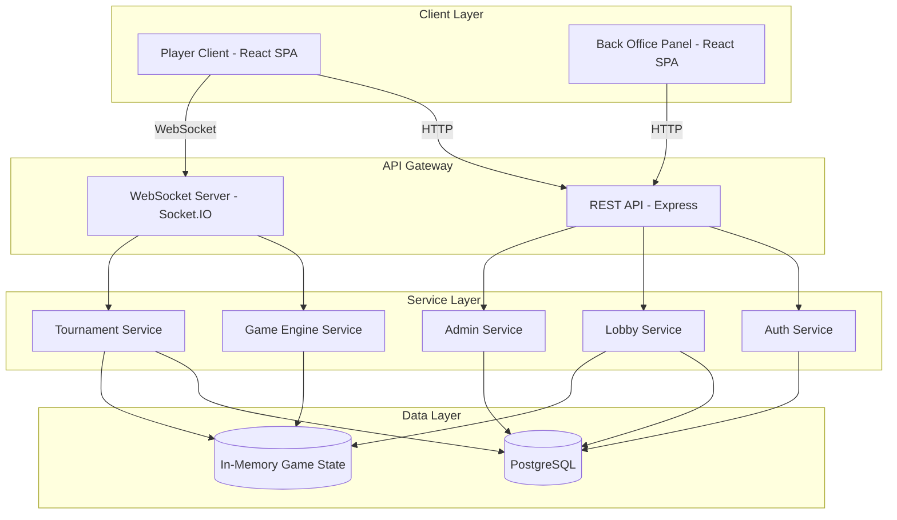
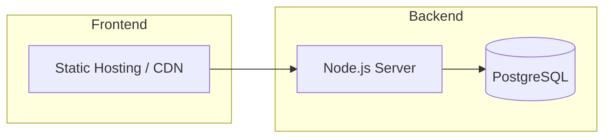
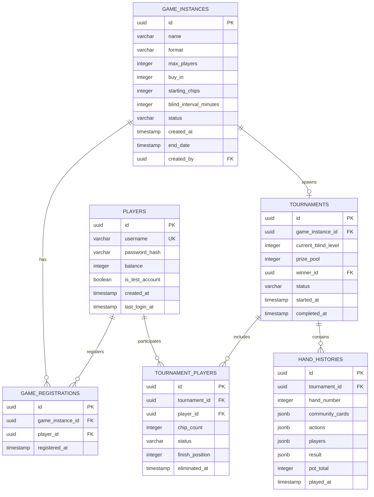

# Design Document: Spin and Go Poker Client

## Overview

This design describes a Spin and Go poker client for PartyPoker supporting play money, 3-player Texas Hold'em tournaments. The system consists of three main parts:

1. **Player Client** — A responsive web application (React + TypeScript) for mobile and desktop that provides lobby browsing, game registration, poker table gameplay, and hand history review.
2. **Back Office Admin Panel** — A separate admin interface for operators to create and manage game instances.
3. **Backend Server** — A Node.js/Express server with WebSocket support that manages game state, authentication, tournament lifecycle, and real-time updates.

The architecture uses a client-server model with WebSockets for real-time game state synchronization and REST APIs for CRUD operations (auth, game management, lobby data).

### Key Design Decisions

| Decision | Choice | Rationale |
|----------|--------|-----------|
| Frontend framework | React + TypeScript | Component-based UI, strong typing, large ecosystem |
| State management | Zustand | Lightweight, minimal boilerplate for real-time game state |
| Real-time communication | Socket.IO | Reliable WebSocket abstraction with reconnection and fallback |
| Backend runtime | Node.js + Express | Event-driven, good WebSocket support, shared TypeScript types |
| Database | PostgreSQL | Relational integrity for accounts, game instances, hand history |
| Authentication | JWT (access + refresh tokens) | Stateless auth suitable for WebSocket and REST |
| Styling | Tailwind CSS | Responsive utility-first CSS, easy mobile/desktop adaptation |
| Testing | Vitest + fast-check | Fast unit/property testing with TypeScript support |

## Architecture



### Communication Patterns

- **REST API**: Authentication, lobby data fetching, game creation (back office), hand history retrieval
- **WebSocket**: Real-time game state updates, player actions, lobby count updates, turn timers, blind level changes

### Deployment Architecture



## Components and Interfaces

### Frontend Components

#### Player Client

```
src/
├── components/
│   ├── auth/
│   │   ├── LoginForm.tsx
│   │   ├── RegisterForm.tsx
│   │   └── AuthGuard.tsx
│   ├── lobby/
│   │   ├── LobbyView.tsx
│   │   ├── GameInstanceCard.tsx
│   │   └── EmptyLobbyMessage.tsx
│   ├── table/
│   │   ├── PokerTable.tsx
│   │   ├── PlayerSeat.tsx
│   │   ├── CommunityCards.tsx
│   │   ├── PotDisplay.tsx
│   │   ├── DealerButton.tsx
│   │   ├── BlindTimer.tsx
│   │   └── ActionPanel.tsx
│   ├── tournament/
│   │   ├── TournamentLobby.tsx
│   │   └── PlayerStandings.tsx
│   ├── history/
│   │   └── LastHandSummary.tsx
│   └── shared/
│       ├── Card.tsx
│       ├── ChipStack.tsx
│       └── Timer.tsx
├── hooks/
│   ├── useAuth.ts
│   ├── useSocket.ts
│   ├── useGameState.ts
│   └── useTurnTimer.ts
├── stores/
│   ├── authStore.ts
│   ├── lobbyStore.ts
│   └── gameStore.ts
├── services/
│   ├── api.ts
│   └── socket.ts
└── types/
    └── index.ts
```

#### Back Office Panel

```
src/admin/
├── components/
│   ├── GameCreationForm.tsx
│   ├── GameInstanceList.tsx
│   └── GameInstanceDetails.tsx
├── stores/
│   └── adminStore.ts
└── services/
    └── adminApi.ts
```

### Backend Services

#### Auth Service

```typescript
interface AuthService {
  register(username: string, password: string): Promise<{ player: Player; tokens: TokenPair }>;
  login(username: string, password: string): Promise<{ player: Player; tokens: TokenPair }>;
  logout(playerId: string): Promise<void>;
  refreshToken(refreshToken: string): Promise<TokenPair>;
  validateToken(accessToken: string): Promise<Player>;
}
```

#### Lobby Service

```typescript
interface LobbyService {
  getAvailableGames(): Promise<GameInstance[]>;
  registerPlayer(playerId: string, gameInstanceId: string): Promise<RegistrationResult>;
  unregisterPlayer(playerId: string, gameInstanceId: string): Promise<void>;
  onPlayerCountChange(callback: (gameInstanceId: string, count: number) => void): void;
}
```

#### Game Engine Service

```typescript
interface GameEngineService {
  startGame(gameInstanceId: string, players: Player[]): Promise<GameState>;
  dealHand(gameId: string): Promise<HandState>;
  processAction(gameId: string, playerId: string, action: PlayerAction): Promise<GameState>;
  evaluateHand(cards: Card[]): HandRanking;
  determinWinner(players: PlayerHand[], communityCards: Card[]): WinnerResult;
}
```

#### Tournament Service

```typescript
interface TournamentService {
  createTournament(gameInstanceId: string, players: Player[]): Promise<Tournament>;
  eliminatePlayer(tournamentId: string, playerId: string): Promise<void>;
  getTournamentState(tournamentId: string): Promise<TournamentState>;
  completeTournament(tournamentId: string): Promise<TournamentResult>;
  progressBlinds(tournamentId: string): Promise<BlindLevel>;
}
```

#### Admin Service

```typescript
interface AdminService {
  createGameInstance(params: GameCreationParams): Promise<GameInstance>;
  listGameInstances(filters?: GameFilters): Promise<GameInstance[]>;
  removeExpiredGames(): Promise<number>;
}
```

### REST API Endpoints

| Method | Endpoint | Description |
|--------|----------|-------------|
| POST | `/api/auth/register` | Register new player |
| POST | `/api/auth/login` | Authenticate player |
| POST | `/api/auth/logout` | End player session |
| POST | `/api/auth/refresh` | Refresh access token |
| GET | `/api/lobby/games` | List available game instances |
| POST | `/api/lobby/games/:id/register` | Register for a game |
| DELETE | `/api/lobby/games/:id/register` | Unregister from a game |
| GET | `/api/history/:gameId/last-hand` | Get last hand summary |
| POST | `/api/admin/games` | Create game instance (admin) |
| GET | `/api/admin/games` | List all game instances (admin) |
| DELETE | `/api/admin/games/:id` | Remove game instance (admin) |

### WebSocket Events

| Event | Direction | Payload | Description |
|-------|-----------|---------|-------------|
| `lobby:update` | Server→Client | `{ gameId, playerCount, status }` | Lobby count change |
| `game:start` | Server→Client | `GameState` | Tournament begins |
| `game:deal` | Server→Client | `{ holeCards, communityCards }` | Cards dealt |
| `game:action` | Client→Server | `PlayerAction` | Player submits action |
| `game:state` | Server→Client | `GameState` | Full state update |
| `game:turn` | Server→Client | `{ playerId, timeRemaining }` | Turn notification |
| `game:blind-change` | Server→Client | `BlindLevel` | Blind level increased |
| `game:eliminate` | Server→Client | `{ playerId, position }` | Player eliminated |
| `game:end` | Server→Client | `TournamentResult` | Tournament complete |
| `player:disconnect` | Server→Client | `{ playerId }` | Player disconnected |

## Data Models

### Player

```typescript
interface Player {
  id: string;                  // UUID
  username: string;            // 3-20 alphanumeric characters
  passwordHash: string;        // bcrypt hash
  balance: number;             // Play money balance (starts at 1000)
  createdAt: Date;
  lastLoginAt: Date;
  isTestAccount: boolean;      // Pre-configured test accounts
}
```

### GameInstance

```typescript
interface GameInstance {
  id: string;                  // UUID
  name: string;                // Operator-defined game name
  format: 'texas_holdem';      // Game format (always Texas Hold'em)
  maxPlayers: number;          // 2-6 (3 for Spin and Go)
  buyIn: number;               // Always 1 (play money)
  startingChips: number;       // 500
  blindIntervalMinutes: number; // 3
  registeredPlayers: string[]; // Player IDs
  status: 'open' | 'full' | 'in_progress' | 'completed';
  createdAt: Date;
  endDate: Date;               // 30 days from creation
  createdBy: string;           // Admin user ID
}
```

### Tournament

```typescript
interface Tournament {
  id: string;                  // UUID
  gameInstanceId: string;      // Reference to GameInstance
  players: TournamentPlayer[];
  currentBlindLevel: number;   // Index into blind schedule
  blindSchedule: BlindLevel[];
  startedAt: Date;
  completedAt: Date | null;
  prizePool: number;           // Sum of buy-ins
  winnerId: string | null;
  status: 'active' | 'completed';
}

interface TournamentPlayer {
  playerId: string;
  username: string;
  chipCount: number;
  status: 'active' | 'eliminated';
  finishPosition: number | null; // 1, 2, or 3
  eliminatedAt: Date | null;
}
```

### BlindLevel

```typescript
interface BlindLevel {
  level: number;
  smallBlind: number;
  bigBlind: number;
}

// Blind schedule (relative to 500 starting chips)
const BLIND_SCHEDULE: BlindLevel[] = [
  { level: 1, smallBlind: 10, bigBlind: 20 },
  { level: 2, smallBlind: 15, bigBlind: 30 },
  { level: 3, smallBlind: 25, bigBlind: 50 },
  { level: 4, smallBlind: 50, bigBlind: 100 },
  { level: 5, smallBlind: 75, bigBlind: 150 },
  { level: 6, smallBlind: 100, bigBlind: 200 },
  { level: 7, smallBlind: 150, bigBlind: 300 },
  { level: 8, smallBlind: 200, bigBlind: 400 },
];
```

### Hand / Game State

```typescript
interface Card {
  rank: '2' | '3' | '4' | '5' | '6' | '7' | '8' | '9' | '10' | 'J' | 'Q' | 'K' | 'A';
  suit: 'hearts' | 'diamonds' | 'clubs' | 'spades';
}

interface HandState {
  id: string;
  tournamentId: string;
  handNumber: number;
  dealerPosition: number;       // 0, 1, or 2
  smallBlindPosition: number;
  bigBlindPosition: number;
  communityCards: Card[];       // 0, 3, 4, or 5 cards
  pot: number;
  sidePots: SidePot[];
  players: HandPlayer[];
  currentPlayerIndex: number;
  bettingRound: 'preflop' | 'flop' | 'turn' | 'river' | 'showdown';
  currentBet: number;           // Highest bet in current round
  minRaise: number;             // Minimum raise amount
  lastAction: PlayerAction | null;
  turnStartedAt: Date;
  turnTimeoutSeconds: number;   // 30
}

interface HandPlayer {
  playerId: string;
  username: string;
  holeCards: Card[];            // 2 cards (only visible to owner)
  chipCount: number;
  currentBet: number;           // Amount bet in current round
  totalBetThisHand: number;
  status: 'active' | 'folded' | 'all_in';
  hasActed: boolean;
}

interface SidePot {
  amount: number;
  eligiblePlayerIds: string[];
}

type PlayerAction =
  | { type: 'check' }
  | { type: 'bet'; amount: number }
  | { type: 'call' }
  | { type: 'raise'; amount: number }
  | { type: 'fold' }
  | { type: 'all_in' };
```

### Hand History

```typescript
interface HandHistory {
  handId: string;
  tournamentId: string;
  handNumber: number;
  blindLevel: BlindLevel;
  players: HandHistoryPlayer[];
  communityCards: Card[];
  actions: HandHistoryAction[];
  pots: { amount: number; winnerId: string }[];
  result: HandResult;
}

interface HandHistoryPlayer {
  playerId: string;
  username: string;
  startingChips: number;
  holeCards: Card[] | null;     // null if folded (not revealed)
  netChipChange: number;
}

interface HandHistoryAction {
  playerId: string;
  bettingRound: 'preflop' | 'flop' | 'turn' | 'river';
  action: PlayerAction;
  timestamp: Date;
}

interface HandResult {
  winnerId: string;
  winningHand: HandRanking | null; // null if won by fold
  method: 'showdown' | 'fold';
}

interface HandRanking {
  rank: number;                // 1 (Royal Flush) to 10 (High Card)
  name: string;                // e.g., "Full House"
  cards: Card[];               // Best 5-card hand
}
```

### Database Schema (PostgreSQL)



## Correctness Properties

*A property is a characteristic or behavior that should hold true across all valid executions of a system — essentially, a formal statement about what the system should do. Properties serve as the bridge between human-readable specifications and machine-verifiable correctness guarantees.*

### Property 1: Registration credential validation

*For any* username string and password string, the registration system SHALL accept the credentials if and only if the username is 3–20 alphanumeric characters and the password is at least 8 characters; otherwise it SHALL reject with an appropriate error message and not create an account.

**Validates: Requirements 1.1, 1.4**

### Property 2: Authentication error message uniformity

*For any* invalid login attempt (whether the username doesn't exist or the password is wrong), the system SHALL return the same generic error message, making it impossible to distinguish between a bad username and a bad password from the response alone.

**Validates: Requirements 1.3**

### Property 3: Route protection for unauthenticated users

*For any* protected route (lobby, game table, tournament lobby, hand history), an unauthenticated request SHALL be redirected to the sign-in screen and SHALL NOT receive protected content.

**Validates: Requirements 1.6**

### Property 4: Lobby game filtering

*For any* set of game instances in the system, the lobby SHALL display exactly those instances where the registered player count is less than the maximum (3) AND the end date has not passed; no other instances SHALL appear.

**Validates: Requirements 2.1**

### Property 5: Game instance display completeness

*For any* game instance displayed in the lobby, the rendered output SHALL contain the game name, buy-in amount, registered player count out of maximum, and a status value that is one of "Open", "Full", or "In Progress".

**Validates: Requirements 2.2**

### Property 6: Registration state machine correctness

*For any* player and game instance, registration SHALL succeed (deducting $1 and adding the player) if and only if: the game has fewer than 3 registered players, the player is not already registered for that game, and the player's balance is at least $1. In all other cases, registration SHALL fail, the player's balance SHALL remain unchanged, and the game's player count SHALL remain unchanged.

**Validates: Requirements 3.1, 3.3, 3.4, 3.5**

### Property 7: New instance creation on game start

*For any* game instance that transitions to "in_progress" status, the system SHALL create a new game instance of the same type with 0 registered players and "open" status.

**Validates: Requirements 4.3**

### Property 8: Expired game cleanup with refunds

*For any* game instance whose end date has passed and has no active session in progress: if it has 0 registered players, it SHALL be removed; if it has 1 or 2 registered players, all registered players SHALL have their $1 buy-in refunded to their balance and the instance SHALL be removed.

**Validates: Requirements 4.4, 4.5**

### Property 9: Lobby availability invariant

*For any* state of the system after any sequence of registrations, game starts, and expirations, there SHALL exist at least one game instance per game type with fewer than the maximum registered players and "open" status visible in the lobby.

**Validates: Requirements 4.6**

### Property 10: Disconnect refund and seat release

*For any* player who disconnects from a game instance that has not yet started (fewer than 3 players), the system SHALL unregister that player, refund their $1 buy-in, and decrement the registered player count.

**Validates: Requirements 4.7**

### Property 11: Game creation parameter validation

*For any* game creation request submitted to the back office, the system SHALL create a game instance if and only if all required parameters are valid (name is non-empty, player count is between 2 and 6); otherwise it SHALL reject with an error indicating which parameters are invalid and SHALL NOT create an instance.

**Validates: Requirements 5.1, 5.8**

### Property 12: End date calculation

*For any* game instance creation date, the end date SHALL be exactly 30 days (720 hours) after the creation timestamp.

**Validates: Requirements 5.6**

### Property 13: Hole card privacy

*For any* active game with multiple players, the game state sent to a specific player SHALL contain that player's hole cards and SHALL NOT contain any other player's hole cards.

**Validates: Requirements 6.5**

### Property 14: Valid action determination

*For any* game state where it is a player's turn, the set of available actions SHALL be exactly: Check is available if and only if no outstanding bet exists; Call is available if and only if an outstanding bet exists and the player has sufficient chips; Bet is available if and only if no outstanding bet exists; Raise is available if and only if an outstanding bet exists and the player has sufficient chips above the call amount; Fold is always available; All-In is available if and only if the player's remaining chips are less than the required call or minimum bet amount.

**Validates: Requirements 7.1, 7.6, 7.7**

### Property 15: Bet and raise amount validation

*For any* bet action, the amount SHALL be accepted if and only if it is between the big blind (minimum bet) and the player's remaining stack. *For any* raise action, the total raise SHALL be accepted if and only if it is at least the size of the previous bet or raise increment and does not exceed the player's remaining stack. All amounts outside these ranges SHALL be rejected with a message indicating the valid range.

**Validates: Requirements 7.3, 7.4, 7.10**

### Property 16: Fold removes player from hand

*For any* active player who performs a fold action, that player's status SHALL change to "folded", they SHALL not be required to act again in the current hand, and they SHALL not be eligible to win the pot.

**Validates: Requirements 7.5**

### Property 17: Card dealing integrity

*For any* hand dealt, each active player SHALL receive exactly 2 hole cards, all cards dealt (hole cards + community cards) SHALL be unique (no duplicates), and all cards SHALL belong to a standard 52-card deck.

**Validates: Requirements 8.1**

### Property 18: Dealer position rotation

*For any* sequence of consecutive hands in a tournament, the dealer position SHALL rotate clockwise (incrementing by 1 modulo the number of active players) after each hand, with small blind and big blind positions following accordingly.

**Validates: Requirements 8.2**

### Property 19: Community card dealing progression

*For any* hand that progresses through betting rounds: after the preflop round completes, exactly 3 community cards SHALL be visible (flop); after the flop round completes, exactly 4 community cards SHALL be visible (turn); after the turn round completes, exactly 5 community cards SHALL be visible (river). Community cards dealt in earlier rounds SHALL not change.

**Validates: Requirements 8.3, 8.4, 8.5**

### Property 20: Hand evaluation and pot award correctness

*For any* showdown between two or more players, the pot SHALL be awarded to the player(s) with the highest-ranking 5-card hand (selected from their 2 hole cards plus 5 community cards) according to standard poker hand rankings. If two or more players have equal rankings, the pot SHALL be split equally among them.

**Validates: Requirements 8.6, 8.7, 8.8**

### Property 21: Fold-win without card reveal

*For any* hand where all players except one fold during any betting round, the pot SHALL be awarded to the remaining player, and the folded players' hole cards SHALL NOT be included in the hand result or revealed to other players.

**Validates: Requirements 8.9**

### Property 22: Side pot calculation

*For any* hand where a player goes all-in and other players continue betting, the system SHALL create a main pot (containing the all-in player's contribution matched by others) and one or more side pots (containing additional bets). The all-in player SHALL only be eligible to win the main pot, not any side pots.

**Validates: Requirements 8.10**

### Property 23: Betting round completion detection

*For any* betting round state, the round SHALL be considered complete if and only if: all active (non-folded, non-all-in) players have acted at least once AND all active players have equal current bets (or all have checked with no outstanding bet).

**Validates: Requirements 8.11**

### Property 24: Blind level application timing

*For any* blind level increase that occurs during an active hand, the new blind amounts SHALL NOT apply to the current hand; they SHALL apply starting from the next hand dealt after the level change.

**Validates: Requirements 9.4**

### Property 25: Tournament elimination and position assignment

*For any* player whose chip count reaches 0 at the end of a hand, that player SHALL be eliminated and assigned a finishing position based on elimination order (last eliminated = 2nd, first eliminated = 3rd for a 3-player tournament). When only one player remains with chips, that player SHALL be declared the winner (1st place). If two players are eliminated on the same hand, the player with more chips at the start of that hand SHALL receive the higher finishing position.

**Validates: Requirements 10.1, 10.2, 10.6**

### Property 26: Prize pool calculation and distribution

*For any* completed tournament, the prize pool SHALL equal the number of players multiplied by the buy-in amount ($1 × 3 = $3), and the full prize pool SHALL be awarded to the 1st place player's account balance.

**Validates: Requirements 10.3, 10.5**

### Property 27: Tournament lobby player data completeness

*For any* tournament state displayed in the tournament lobby, all players SHALL be listed with their username, current chip count (if active) or finishing position (if eliminated), and a status of either "Active" or "Eliminated".

**Validates: Requirements 11.3**

### Property 28: Hand history record completeness

*For any* completed hand, the hand history record SHALL contain: player actions organized by betting round, community cards dealt at each stage, final pot size, winning player, method of victory (showdown with hand ranking or last player after folds), and the net chips won or lost by each player.

**Validates: Requirements 12.2, 12.3**

## Error Handling

### Client-Side Error Handling

| Error Category | Handling Strategy |
|---------------|-------------------|
| Network disconnection | Show reconnection overlay, attempt automatic reconnection with exponential backoff (1s, 2s, 4s, 8s, max 30s). If in active game, preserve local state and resync on reconnect. |
| WebSocket timeout | Fall back to REST polling for game state every 2 seconds until WebSocket reconnects. |
| Authentication expiry | Silently refresh token using refresh token. If refresh fails, redirect to login. |
| Invalid action submission | Display inline error with valid range/options. Do not submit to server. |
| Server error (5xx) | Display generic "Something went wrong" message with retry button. Log error details to console. |
| Validation error (4xx) | Display specific error message from server response. |

### Server-Side Error Handling

| Error Category | Handling Strategy |
|---------------|-------------------|
| Player disconnect during game | Start 60-second reconnection window. Auto-fold on turn timeout (30s). If not reconnected within 60s, auto-fold all subsequent turns. |
| Concurrent registration race | Use database transaction with row-level locking on game instance. Return "game full" if lock reveals 3 players. |
| Invalid game state transition | Reject action, log anomaly, return current valid state to client. |
| Database connection failure | Retry with exponential backoff. Game state preserved in memory cache. Persist to DB when connection restores. |
| Expired JWT on WebSocket | Send `auth:expired` event, client must re-authenticate within 10 seconds or connection is closed. |

### Graceful Degradation

- If real-time updates fail, the lobby falls back to polling every 5 seconds
- If hand history write fails, game continues (history is non-critical path)
- If blind timer desynchronizes, server is authoritative — client resyncs on next state update

## Testing Strategy

### Testing Framework

- **Unit & Property Tests**: Vitest + fast-check (TypeScript property-based testing library)
- **Integration Tests**: Vitest with supertest (REST API) and socket.io-client (WebSocket)
- **E2E Tests**: Playwright (cross-browser, mobile viewport testing)
- **Visual Regression**: Playwright screenshot comparison

### Property-Based Testing Configuration

Each property test runs a minimum of **100 iterations** with randomized inputs. Tests are tagged with their corresponding design property:

```typescript
// Tag format example:
// Feature: spin-and-go-poker-client, Property 20: Hand evaluation and pot award correctness
```

### Test Categories

#### Unit Tests (Example-Based)
- Authentication flow (login, register, logout)
- Specific poker hand evaluations (known hands → known rankings)
- Blind schedule configuration validation
- UI component rendering (specific states)
- Pre-configured test account existence

#### Property-Based Tests
- Registration validation (Property 1)
- Error message uniformity (Property 2)
- Lobby filtering logic (Property 4)
- Registration state machine (Property 6)
- Game creation validation (Property 11)
- Hole card privacy (Property 13)
- Valid action determination (Property 14)
- Bet/raise validation (Property 15)
- Card dealing integrity (Property 17)
- Position rotation (Property 18)
- Community card progression (Property 19)
- Hand evaluation correctness (Property 20)
- Side pot calculation (Property 22)
- Betting round completion (Property 23)
- Tournament elimination (Property 25)
- Prize calculation (Property 26)
- Hand history completeness (Property 28)

#### Integration Tests
- WebSocket real-time lobby updates (< 3 second propagation)
- Game auto-start when 3 players register
- Turn timer and auto-fold (30 second timeout)
- Blind level progression (3 minute intervals)
- Expired game cleanup (within 60 seconds)
- Disconnect/reconnect handling

#### E2E Tests
- Full registration → lobby → register → play → win flow
- Responsive layout at 320px, 768px, 1024px, 1920px
- Touch interaction on mobile viewports
- Portrait/landscape orientation switching
- Cross-browser compatibility (Chrome, Firefox, Safari)

### Test Priority

1. **Critical** (must pass before merge): Properties 6, 14, 15, 17, 20, 22, 25 — core game logic
2. **High** (should pass): Properties 1, 4, 13, 18, 19, 23, 26, 28 — game integrity
3. **Medium** (nice to have): Properties 2, 3, 5, 7, 8, 9, 10, 11, 12, 24, 27 — supporting features

